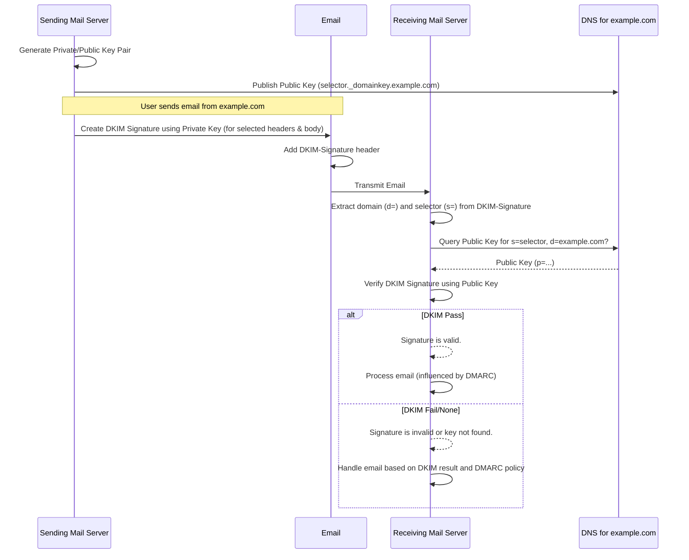

# DomainKeys Identified Mail (DKIM)

DomainKeys Identified Mail (DKIM) is an email authentication method designed to detect email spoofing. It allows the receiver to check that an email claimed to have come from a specific domain was indeed authorized by the owner of that domain. This is achieved by affixing a digital signature, linked to a domain name, to each outgoing email message.

## 1. How DKIM Works

1.  **Key Generation**: The domain administrator generates a public/private key pair.
    *   The **private key** is kept secret on the sending mail server(s).
    *   The **public key** is published in the domain's DNS as a TXT record at a specific location (e.g., `selector._domainkey.example.com`).
2.  **Signing Outgoing Email**:
    *   When an email is sent from the domain, the sending mail server (or a dedicated signing module) uses the private key to create a digital signature.
    *   This signature is based on the content of selected email headers and the body (or part of the body).
    *   The signature, along with information about how it was created (e.g., the selector used, the domain, the signed headers), is added to the email as a `DKIM-Signature` header.
3.  **Verification by Receiving Server**:
    *   The receiving mail server sees the `DKIM-Signature` header in the incoming email.
    *   It extracts the domain (`d=` tag) and the selector (`s=` tag) from this header.
    *   It constructs the DNS query (e.g., `selector._domainkey.example.com`) to retrieve the public key from the sender's DNS.
    *   Using the retrieved public key, the receiving server attempts to verify the signature in the `DKIM-Signature` header against the email's content and headers.
4.  **Action**:
    *   If the signature is valid, it provides assurance that the email originated from the claimed domain and that the signed parts of the email have not been tampered with during transit. This results in a DKIM "pass".
    *   If the signature is invalid or the public key cannot be retrieved, it results in a DKIM "fail" or "none".
    *   The DKIM result, along with SPF, contributes to DMARC evaluation.

## 2. DKIM Record Syntax and Parameters (TXT Record)

A DKIM public key record is published as a TXT record in DNS. The record consists of tag-value pairs.

**Location**: `selector._domainkey.yourdomain.com`
   - `selector`: A specific string chosen by the domain administrator (e.g., `s1024`, `google`, `default`). Multiple selectors can exist for a domain, allowing for different keys for different services or key rotation.
   - `_domainkey`: A literal string.

**General Format**: `"v=DKIM1; k=rsa; p=[public key data]; [other tags]"`

### Common Tags in a DKIM Record:

-   `v=DKIM1`: **Version**. Specifies the DKIM version. `DKIM1` is currently the only version. This tag is optional but recommended.
-   `k=rsa`: **Key type**. Specifies the signing algorithm. `rsa` is the most common.
-   `p=`: **Public key data**. The Base64 encoded public key. This is the core part of the record. If this tag is empty (`p=`), it means this DKIM key has been revoked, and emails signed with the corresponding private key should fail verification.
-   `s=`: **Service type**. (Optional) Specifies the service types to which this record applies. `*` (all services), `email` (email service). Default is `*`.
-   `t=`: **Flags**. (Optional)
    *   `y`: (Testing mode) Indicates that the domain is testing DKIM. Receivers should not treat messages from this domain differently if verification fails.
    *   `s`: (Subdomains) If present, this key is not to be used for signing by subdomains (i.e., strict domain match). If absent, the key can be used by subdomains of the `d=` domain.
-   `h=`: **Acceptable hash algorithms**. (Optional) A colon-separated list of hash algorithms that might be used (e.g., `sha256`, `sha1`). `sha256` is recommended.
-   `n=`: **Notes**. (Optional) Arbitrary text for human administrators. Not interpreted by verifiers.

**Example DKIM Record**:
For `selector1._domainkey.example.com`:
`"v=DKIM1; k=rsa; p=MIGfMA0GCSqGSIb3DQEBAQUAA4GNADCBiQKBgQC3g...rest of public key...AQAB; t=s"`

## 3. `DKIM-Signature` Header Fields

The `DKIM-Signature` header added to emails also contains tag-value pairs:

-   `v=1`: **Version** of the DKIM specification.
-   `a=`: **Signing algorithm** (e.g., `rsa-sha256`).
-   `s=`: **Selector** used for signing.
-   `d=`: **Domain** that signed the message (the "signing domain").
-   `c=`: **Canonicalization algorithm(s)** for header and body (e.g., `relaxed/simple`). Defines how email data is normalized before signing/verifying.
    *   `simple`: Tolerates almost no modification.
    *   `relaxed`: Tolerates common modifications like whitespace changes. `relaxed/relaxed` is common.
-   `q=`: **Query method(s)** used to retrieve the public key (e.g., `dns/txt`).
-   `h=`: **List of signed header fields**, colon-separated (e.g., `From:To:Subject:Date:Message-ID`). The `From` header must always be included.
-   `bh=`: **Body hash**. The Base64 encoded hash of the canonicalized email body.
-   `b=`: **The digital signature** itself, Base64 encoded.
-   `t=`: **Timestamp** of when the signature was applied (seconds since epoch). (Optional)
-   `x=`: **Expiration timestamp** for the signature. (Optional)
-   `l=`: **Body length count**. (Optional) Number of bytes of the canonicalized body that were hashed. If present, only the first `l` bytes of the body are signed.

## 4. DKIM Selectors

-   Selectors allow a domain to have multiple DKIM keys active simultaneously. This is useful for:
    *   Different departments or services sending email (e.g., marketing vs. transactional).
    *   Third-party senders (e.g., Mailchimp, SendGrid) who sign on behalf of the domain.
    *   Key rotation: A new key can be introduced with a new selector while the old one is gradually phased out.
-   The application `SPF-DMARC-DKIM` attempts to find common selectors because senders don't announce which selector they use in a general way; it's only present in the `DKIM-Signature` header of an actual email.

## 5. Risks of Misconfiguration or Absence of DKIM

-   **Increased Susceptibility to Spoofing and Phishing**: Without DKIM, it's harder for receiving servers to verify that an email genuinely originated from your domain and that its content (especially key headers) hasn't been tampered with.
-   **Damaged Domain Reputation**: If attackers successfully spoof your domain and send malicious emails, your domain's reputation can suffer, leading to legitimate emails being flagged as spam or rejected.
-   **Email Tampering Undetected**: DKIM helps ensure the integrity of signed parts of an email. Without it, modifications to important headers or the body might go unnoticed.
-   **Deliverability Issues**:
    *   **No DKIM**: Many email providers view DKIM as a strong indicator of legitimacy. Missing DKIM can negatively impact deliverability.
    *   **DKIM Failures**: If DKIM is set up but signatures consistently fail (due to key mismatches, incorrect DNS records, or issues with the signing process), emails may be treated with suspicion or rejected.
    *   **Revoked Key (`p=` empty)**: If a DKIM record has an empty `p=` tag, it signals that the key is revoked. Emails signed with the corresponding private key will fail DKIM. This is intentional for key rotation or compromise but must be managed correctly.
-   **Ineffective DMARC**: DKIM is a core component of DMARC. DMARC checks for alignment between the domain in the `DKIM-Signature` (`d=` tag) and the `From` header domain. If DKIM is not implemented or fails, DMARC cannot effectively use it for authentication.
-   **Selector Issues**:
    *   Using a selector for which no public key is published in DNS will cause DKIM failures.
    *   Publishing an incorrect public key will cause signature verification failures.
-   **Canonicalization Issues**: Choosing overly strict canonicalization (e.g., `simple/simple`) can lead to DKIM failures if emails pass through intermediate mail servers that make minor, usually benign, modifications (like adding a footer or changing whitespace). `relaxed/relaxed` is generally more robust.

**Best Practices**:
-   Implement DKIM for all legitimate email streams.
-   Use strong keys (e.g., 2048-bit RSA) and secure hash algorithms (e.g., SHA-256).
-   Regularly rotate DKIM keys using different selectors.
-   Ensure your DNS records are accurate and propagate correctly.
-   Monitor DKIM signing and verification results, preferably through DMARC reports.
-   Use `relaxed/relaxed` canonicalization unless you have a specific reason not to.
-   Sign important headers, always including `From`, `To`, `Subject`, and `Date`.
