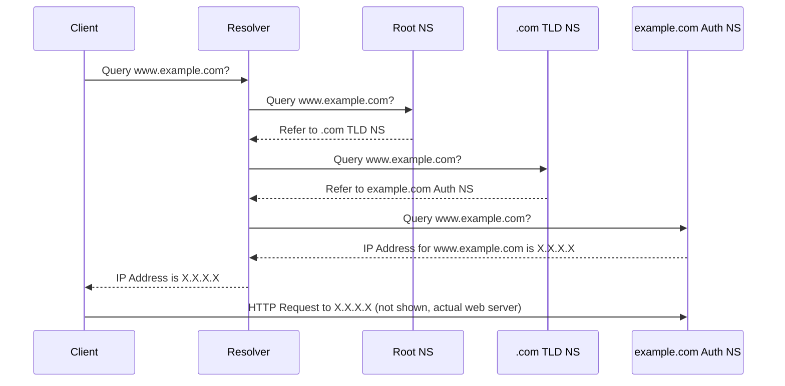

# Understanding the Domain Name System (DNS)

The Domain Name System (DNS) is a hierarchical and decentralized naming system for computers, services, or other resources connected to the Internet or a private network. It translates human-readable domain names (like `www.example.com`) into machine-readable IP addresses (like `192.0.2.44`). DNS also provides other information for domains, such as mail server (MX) records.

## 1. How DNS Works: The Resolution Process

When you type a domain name into your web browser, a series of steps occur to find the corresponding IP address:

1.  **Local Cache Check**: Your computer first checks its local DNS cache (and browser cache) to see if it has recently resolved this domain. If found, the IP address is used directly.
2.  **Resolver Query**: If not in the local cache, your computer (the "DNS client") queries a DNS resolver (usually provided by your Internet Service Provider - ISP, or a public resolver like Google's `8.8.8.8` or Cloudflare's `1.1.1.1`).
3.  **Recursive Query (by Resolver)**: The resolver starts a recursive query to find the IP address:
    *   **Root Servers**: The resolver queries one of the DNS root name servers. There are 13 sets of these servers globally. Root servers don't know the IP address for `www.example.com`, but they know where to find the name servers for the Top-Level Domain (TLD) `.com`. They respond with a referral to the `.com` TLD name servers.
    *   **TLD Name Servers**: The resolver then queries one of the `.com` TLD name servers. These servers don't know the IP for `www.example.com`, but they know the authoritative name servers for the `example.com` domain. They respond with a referral to `example.com`'s authoritative name servers.
    *   **Authoritative Name Servers**: Finally, the resolver queries one of `example.com`'s authoritative name servers. These servers hold the actual DNS records for the `example.com` domain. They look up the record for `www` (or the base domain) and respond to the resolver with the IP address.
4.  **Response to Client**: The resolver receives the IP address from the authoritative name server. It caches this information for a period specified by the Time-To-Live (TTL) value of the DNS record and then returns the IP address to your computer.
5.  **Connection**: Your computer now uses this IP address to connect to the web server hosting `www.example.com`.

## 2. Common DNS Record Types

DNS uses various record types to store different kinds of information about a domain. Some of the most common include:

-   **A (Address) Record**: Maps a domain name to an IPv4 address.
    *   Example: `example.com. IN A 192.0.2.1`
-   **AAAA (IPv6 Address) Record**: Maps a domain name to an IPv6 address.
    *   Example: `example.com. IN AAAA 2001:db8::1`
-   **CNAME (Canonical Name) Record**: Creates an alias from one domain name to another (the "canonical" name). The DNS resolution will continue with the canonical name.
    *   Example: `www.example.com. IN CNAME example.com.`
-   **MX (Mail Exchange) Record**: Specifies the mail servers responsible for accepting email messages on behalf of a domain. It includes a priority value (lower numbers indicate higher priority).
    *   Example: `example.com. IN MX 10 mail.example.com.`
-   **TXT (Text) Record**: Allows administrators to insert arbitrary text into a DNS record. TXT records are used for various purposes, including:
    *   **SPF (Sender Policy Framework)**: To declare which mail servers are authorized to send email for a domain.
    *   **DKIM (DomainKeys Identified Mail)**: To store the public key used to verify email signatures.
    *   **DMARC (Domain-based Message Authentication, Reporting, and Conformance)**: To publish policies for email authentication and reporting.
    *   Domain ownership verification for services like Google Search Console, Microsoft 365, etc.
    *   Example (SPF): `example.com. IN TXT "v=spf1 mx -all"`
-   **NS (Name Server) Record**: Delegates a DNS zone to use the given authoritative name servers.
    *   Example: `example.com. IN NS ns1.nameserver.com.`
-   **PTR (Pointer) Record**: Used for reverse DNS lookups, mapping an IP address back to a domain name. Primarily used in the `in-addr.arpa` (IPv4) and `ip6.arpa` (IPv6) zones.
    *   Example: `1.2.0.192.in-addr.arpa. IN PTR example.com.`
-   **SOA (Start of Authority) Record**: Contains administrative information about a DNS zone, including the primary name server, email of the domain administrator, domain serial number, and timers relating to refreshing the zone.
-   **SRV (Service) Record**: Specifies the location (hostname and port number) of servers for specific services, rather than a generic IP address.
    *   Example: `_sip._tcp.example.com. IN SRV 10 60 5060 sipserver.example.com.`

## 3. DNS and Email Security

DNS plays a crucial role in email security through records like SPF, DKIM, and DMARC:

-   **SPF (Sender Policy Framework)** records (published as TXT records) allow domain owners to specify which mail servers are authorized to send email on behalf of their domains. Receiving mail servers check the SPF record to verify the sender's authenticity.
-   **DKIM (DomainKeys Identified Mail)** records (published as TXT records, typically at `selector._domainkey.example.com`) provide a public key that receiving mail servers can use to verify a cryptographic signature attached to an email message. This signature confirms that the email originated from an authorized server and has not been tampered with in transit.
-   **DMARC (Domain-based Message Authentication, Reporting, and Conformance)** records (published as TXT records at `_dmarc.example.com`) allow domain owners to specify policies for how receiving mail servers should handle emails that fail SPF or DKIM checks. DMARC also enables reporting mechanisms, providing domain owners with feedback on email authentication results.

These records help combat email spoofing, phishing, and other forms of email abuse by providing mechanisms for verifying the authenticity and integrity of email messages.

## 4. DNS Propagation

When a DNS record is created, updated, or deleted, these changes are not instantaneous across the entire internet. This delay is known as DNS propagation. It can take anywhere from a few minutes to 48 hours (or even longer in rare cases) for DNS changes to be fully propagated worldwide. This is due to:

-   **Caching**: DNS resolvers and servers cache records for a period defined by their TTL (Time-To-Live) value. Until the cache expires, they will serve the old record.
-   **Authoritative Server Updates**: Changes must first be made on the authoritative name servers for the domain.
-   **Recursive Resolver Updates**: Recursive resolvers around the world will only pick up the changes when their cache for that record expires and they re-query the authoritative servers.

Understanding DNS propagation is important when configuring email security records, as changes may not take effect immediately for all recipients.
