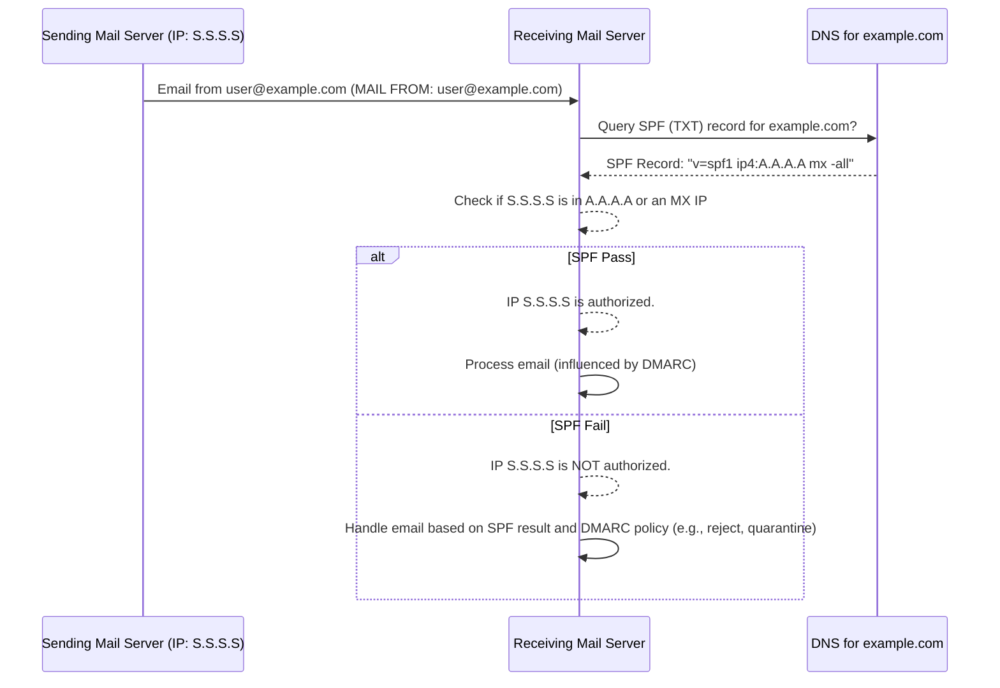

# Sender Policy Framework (SPF)

Sender Policy Framework (SPF) is an email authentication standard that helps protect domain owners from email spoofing and phishing attacks. It allows domain administrators to specify which mail servers are authorized to send email on behalf of their domain. Receiving mail servers can then check the SPF record of the purported sending domain to verify if the email is coming from an authorized source.

## 1. How SPF Works

1.  **Publication**: The domain administrator publishes an SPF record in their domain's DNS as a TXT record. This record lists the IP addresses or hostnames of servers permitted to send email for that domain.
2.  **Email Sending**: When an email is sent, the sending mail server's IP address is part of the email's transmission data (specifically, the "envelope sender" or `MAIL FROM` address).
3.  **Verification by Receiving Server**:
    *   The receiving mail server extracts the domain from the `MAIL FROM` address (also known as the envelope sender, Return-Path, or bounce address).
    *   It then performs a DNS lookup to retrieve the SPF (TXT) record for that domain.
    *   The receiving server checks if the connecting mail server's IP address is listed or permitted by the mechanisms in the SPF record.
4.  **Action**: Based on the SPF check result (pass, fail, softfail, neutral, etc.), the receiving server can decide how to handle the email (e.g., accept, reject, mark as spam). This decision is often influenced by DMARC policies.

## 2. SPF Record Syntax and Parameters

An SPF record is a single string of text published as a DNS TXT record. It starts with `v=spf1` (version 1) followed by a series_of_mechanisms and an optional qualifier.

**General Format**: `v=spf1 [mechanisms] [modifier]`

### 2.1. Version Tag

-   `v=spf1`: This tag is mandatory and must be the first part of the record. It indicates that this is an SPF version 1 record.

### 2.2. Mechanisms

Mechanisms define the hosts that are authorized to send mail for the domain. Each mechanism can be prefixed with a qualifier.

-   **`all`**: This mechanism always matches. It is usually used as the last mechanism to provide a default result.
    *   `+all`: (Pass) Allows any sender. Not recommended.
    *   `-all`: (Fail) Specifies that any server not explicitly listed is not authorized. This is the recommended strict policy.
    *   `~all`: (SoftFail) Specifies that any server not explicitly listed is probably not authorized. Emails might be accepted but marked as suspicious.
    *   `?all`: (Neutral) The domain owner makes no assertion about the sender's validity.
-   **`a`**: Matches if the sender's IP address is one of the domain's A or AAAA records.
    *   Example: `a` (for the current domain)
    *   Example: `a:mail.example.com` (for a specific hostname)
-   **`mx`**: Matches if the sender's IP address is one of the domain's MX records.
    *   Example: `mx` (for the current domain's MXs)
    *   Example: `mx:otherdomain.com` (for MXs of another domain)
-   **`ip4`**: Matches if the sender's IP address is within the given IPv4 address or range.
    *   Example: `ip4:192.0.2.1`
    *   Example: `ip4:192.0.2.0/24`
-   **`ip6`**: Matches if the sender's IP address is within the given IPv6 address or range.
    *   Example: `ip6:2001:db8::1`
    *   Example: `ip6:2001:db8::/32`
-   **`include`**: Includes the SPF policy of another domain. If the other domain's SPF check passes, this mechanism passes. This is useful for authorizing third-party services (e.g., email marketing platforms).
    *   Example: `include:sendgrid.net`
    *   **Important**: The `include` mechanism counts towards the 10 DNS lookup limit for SPF.
-   **`exists`**: Checks if a DNS A record exists for a given domain. If it resolves, this mechanism matches. This is an advanced mechanism.
    *   Example: `exists:%{ir}._spf.example.com` (where `%{ir}` is the reverse IP of the sender)
-   **`ptr`**: (Discouraged) Checks if the PTR record (reverse DNS) for the client IP resolves to a hostname in the given domain, and that hostname resolves back to the client IP. This mechanism is slow and unreliable, and its use is generally discouraged.

### 2.3. Qualifiers

Each mechanism can be prefixed by one of four qualifiers:

-   `+` **Pass**: (Default if no qualifier is present) The IP address is authorized.
    *   Example: `+mx`
-   `-` **Fail**: The IP address is explicitly not authorized. Emails should be rejected.
    *   Example: `-all`
-   `~` **SoftFail**: The IP address is probably not authorized. Emails should be accepted but marked as suspicious or subjected to further scrutiny.
    *   Example: `~all`
-   `?` **Neutral**: The domain makes no assertion about the IP address.
    *   Example: `?all`

### 2.4. Modifiers

Modifiers provide additional information or alter how the SPF record is processed. There are two main modifiers:

-   **`redirect`**: Points to another domain's SPF record that should be used instead of the current one. If a `redirect` modifier is present, any `all` mechanism is ignored. Only one `redirect` is allowed, and it should be the last term in the record if used.
    *   Example: `v=spf1 redirect=_spf.example.com`
-   **`exp` (Explanation)**: If an SPF check results in a `Fail` (due to a mechanism like `-all`), the receiving server can query for a TXT record at the domain specified by the `exp` modifier. The content of this TXT record can provide an explanation message to the sender. This is rarely used.
    *   Example: `v=spf1 -all exp=explain._spf.example.com`

## 3. Example SPF Records

-   **Simple, allow only own MX servers**:
    `v=spf1 mx -all`
    *(Allows mail from servers listed in the domain's MX records and rejects all others.)*

-   **Allow MX servers and a specific IP address**:
    `v=spf1 mx ip4:192.0.2.100 -all`

-   **Allow own servers and a third-party service (e.g., Google Workspace)**:
    `v=spf1 include:_spf.google.com ~all`
    *(Includes Google's SPF record. `~all` suggests that other sources are likely unauthorized but might not be strictly rejected.)*

-   **Strict policy with only specific IPs**:
    `v=spf1 ip4:203.0.113.5 ip4:198.51.100.0/24 -all`

## 4. SPF Limitations and Considerations

-   **10 DNS Lookup Limit**: An SPF record check must not result in more than 10 DNS lookups (for mechanisms like `a`, `mx`, `include`, `ptr`, `exists`, and `redirect`). Exceeding this limit can cause a "permerror" (permanent error), leading to SPF failure. This is a common misconfiguration issue.
-   **`include` vs. `redirect`**:
    *   `include` incorporates another domain's policy as part of the current domain's evaluation.
    *   `redirect` completely replaces the current domain's policy with another's.
-   **Void Lookups**: DNS lookups that result in an NXDOMAIN (non-existent domain) or NODATA (no record of the queried type) response still count towards the 10 DNS lookup limit.
-   **SPF and Forwarding**: SPF can break when emails are forwarded because the forwarding server's IP address might not be listed in the original sender's SPF record. Sender Rewriting Scheme (SRS) is a mechanism designed to address this issue.
-   **Alignment with `From` Header**: SPF validates the domain in the `MAIL FROM` (envelope sender) address, which is often hidden from the end-user. The `From` header (visible to the user) can be different and spoofed. DMARC addresses this by checking alignment between the `MAIL FROM` domain and the `From` header domain.
-   **TXT Record Length**: While DNS TXT records can technically hold multiple strings, each string is limited to 255 characters. For very long SPF records, they must be split into multiple quoted strings within a single TXT record. Most DNS providers handle this automatically.
    *   Example: `"v=spf1 ...first part..." " ...second part..."`

## 5. Risks of Misconfiguration or Absence of SPF

-   **Email Spoofing**: Without SPF, or with a weak SPF record (e.g., `?all` or overly permissive `+all`), attackers can more easily spoof emails from your domain, potentially tricking recipients into revealing sensitive information or performing harmful actions.
-   **Phishing Attacks**: Spoofed emails are a primary vector for phishing. A strong SPF policy helps mitigate this risk.
-   **Damaged Domain Reputation**: If your domain is used for spoofing, its reputation can be damaged, leading to legitimate emails being marked as spam or rejected.
-   **Deliverability Issues**:
    *   **No SPF Record**: Some receiving mail servers may penalize or reject emails from domains without an SPF record.
    *   **Incorrect SPF Record (PermError)**: If your SPF record is syntactically incorrect or exceeds the 10 DNS lookup limit, it will result in a "permerror." Many receivers treat permerror as a fail, leading to legitimate emails being rejected.
    *   **Overly Restrictive SPF**: If your SPF record does not include all legitimate sending sources (e.g., new third-party mailers), legitimate emails from those sources may be rejected or marked as spam.
-   **Ineffective DMARC**: SPF is a foundational component for DMARC. If SPF is not configured correctly, DMARC cannot function effectively for SPF alignment checks.

**Best Practices**:
-   Always use `-all` (Fail) or `~all` (SoftFail) as the last mechanism. `-all` is preferred for a stricter policy.
-   Regularly audit your SPF record to ensure it accurately reflects all authorized sending sources.
-   Be mindful of the 10 DNS lookup limit, especially when using `include` mechanisms. Use tools to check your SPF record's validity and lookup count.
-   Implement DMARC to gain visibility into SPF results and to define a policy for handling failures.
